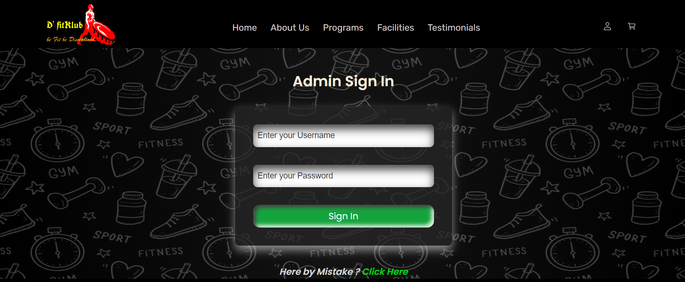

# DfitKub

DfitKlub is a straightforward, comprehensive web project designed to offer e-commerce services to a fictional organization with the same name. The website is intuitive and user-centric.

    Welcome to D'fitKlub where where fitness is redefined, and individuals are empowered on their journey to a healthier lifestyle. We're more than just a gym; we're a dedicated community helping you achieve fitness goals, offering personalized and sustainable programs for all fitness levels from elite athletes to home enthusiasts. Transform your life with us.

## Features

-   The project comprises two interfaces: one for users and another for administrators.
-   On the user-end interface, users have the capability to:
    -   Place orders for products and specify the desired quantity.
    -   Access their profile details and order history.
    -   Update their basic contact information and passwords.
-   On the admin-end interface, administrators can perform the following tasks:
    -   Add new items to the food menu.
    -   Adjust product prices in accordance with inflation rates.
    -   Monitor and fulfill customer orders.
    -   Verify the functionality of the website from their perspective.
-   Cookies are utilized for session creation and management purposes.

## Build With :

<ul>
    <li><a href="https://www.w3schools.com/html/" target="_blank">HTML</a></li>
    <li><a href="https://www.w3schools.com/css/" target="_blank">CSS</a></li>
    <li><a href="https://www.w3schools.com/js/" target="_blank">JavaScript</a></li>
    <li><a href="https://www.w3schools.com/bootstrap5/index.php" target="_blank">Bootstrap</a></li>
    <li><a href="https://expressjs.com/" target="_blank">ExpressJS</a></li>
    <li><a href="https://www.w3schools.com/mysql/default.asp" target="_blank">MySQL</a></li>
</ul>

## Install and Run :

-   Clone the repository or download the ZIP folder.
-   Extract the ZIP folder.
-   Import the data from the `dfitklubDB.sql` file into your `MySQL` Database.
-   Install `NodeJS` on your system.
-   Navigate to the location of the extracted or cloned project in your command prompt or terminal.
-   Enter `npm install` in your command prompt or terminal.
-   To launch the project on your server, type `npm start`.
-   Open your web browser and enter `localhost:` followed by the `port number`.

## Screenshots :

Here are some of the screenshot of Food Ordering Website.

1. Landing Page :  
     
     
     
     
     
2. SignUp Page :     
3. SignIn Page :     
4. Store Page :      
5. User Profile :      
6. Edit Profile :     
7. Cart Page :      
8. Confirmation Page :     
9. Details and Order History Page :     
10. Admin SignIn Page :      
11. Admin Welcome Page :     
12. Admin Add Product Page :     
13. Update Product Price Page :     
14. Admin Order View & Dispatching Page :     
